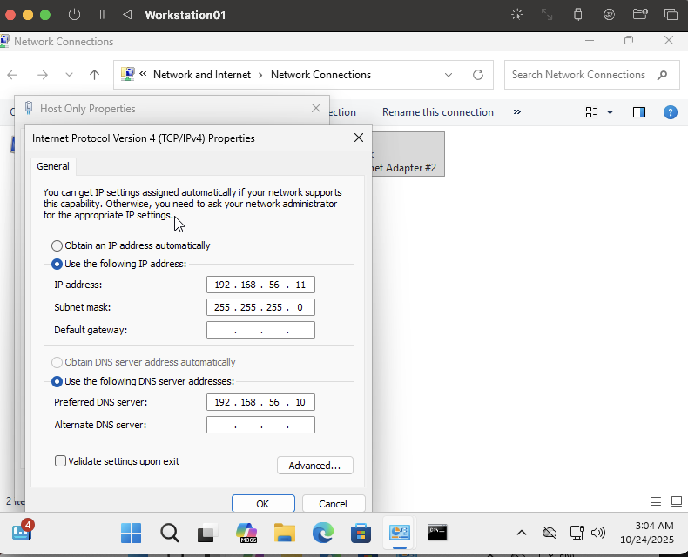

# 🧩 Lab 1 — Network File Sharing Setup

### Objective
Build a local client–server network in a virtual environment and configure file sharing permissions using local user authentication.

This lab demonstrates the process of setting up a static IP configuration, verifying network connectivity, creating local user accounts, configuring shared folders, and validating read/write access from a client system.

---

### 🖥️ Environment
- **Virtualization Tool:** UTM (macOS host)  
- **Server:** Windows 11 (Pro) — `DC01`  
- **Client:** Windows 11 (Pro) — `Workstation01`  
- **Network Type:** Host-Only (192.168.56.0/24)

---

## Steps & Screenshots

### 1️⃣ Server IP Configuration
Configured the **DC01** network adapter with a static IP to act as the local server.

IP Address: 192.168.56.10  
Subnet Mask: 255.255.255.0  
Preferred DNS: 127.0.0.1

---

### 2️⃣ Client IP Configuration
Configured **Workstation01** to communicate within the same subnet and point DNS to the server.

IP Address: 192.168.56.11  
Subnet Mask: 255.255.255.0  
Preferred DNS: 192.168.56.10

---

### 3️⃣ Network Connectivity Test
Pinged the server from the client to verify successful communication.

---

### 4️⃣ User Account Creation on Server
Created a local user account **jdoe** on **DC01** for controlled file-share access.

---

### 5️⃣ Shared Folder Setup
Created a folder `C:\Shared`, configured share permissions for the `jdoe` account with **Read** and **Change** privileges (least-privilege access).

---

### 6️⃣ Client Connection Test
Accessed the shared folder from the client using `\\192.168.56.10`.  
Authenticated as **DC01\jdoe**.

---

### 7️⃣ File Creation Test
From **Workstation01**, created a text file `test.txt` inside the shared folder to verify write permissions.

---

## ✅ Outcome
- Successfully established communication between server and client.  
- Configured a shared folder with restricted access for a local user.  
- Verified both read and write functionality from the client side.

---

### 🧠 Skills Demonstrated
- Windows Networking Configuration  
- IP Addressing and DNS Setup  
- File Sharing & NTFS Permissions  
- Local User Management  
- Client Authentication  
- Documentation of IT Lab Workflows  

---

**Author:** Luis Chris Mejia  
**Repository:** [Help-Desk Portfolio](https://github.com/ChrisCyberTech/help-desk-portfolio)

---

