# Lab 10 – System Performance Diagnostics
Investigate and improve system performance using Task Manager, Event Viewer, and system health tools.

---

## Objective
In this lab, I performed a full system performance diagnostic using built-in Windows tools. I identified CPU, memory, disk, and system log issues using Task Manager, Event Viewer, Resource Monitor, and system integrity utilities such as SFC, DISM, CHKDSK, and SMART health checks. I also applied a basic optimization fix and verified system stability afterward.

---

## Evidence Location
All screenshots are stored in the **/screenshots** folder.

---

# Step 1 – Initial System Assessment (Task Manager)

### Processes Overview
I opened Task Manager to review active applications and background processes, checking CPU, memory, disk, and network usage for any bottlenecks.

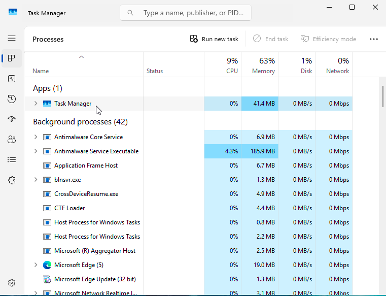

### Performance Tab
I reviewed the Performance tab to observe real-time hardware activity and resource utilization.

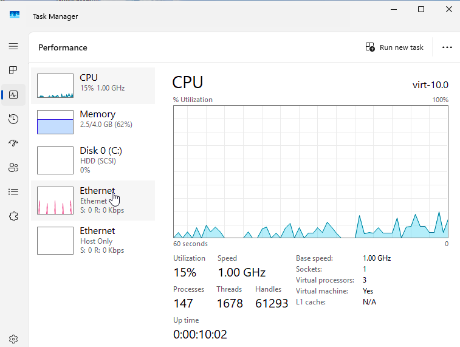

### Startup Apps
I examined the Startup Apps tab to identify programs that may slow down system boot time.

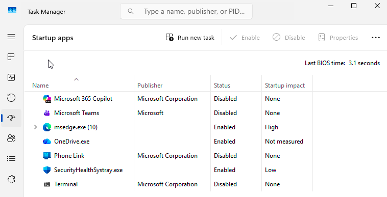

---

# Step 2 – Deep Diagnostics (Resource Monitor)

### Overview Pane
I opened Resource Monitor for a more detailed breakdown of CPU, memory, disk, and network usage.

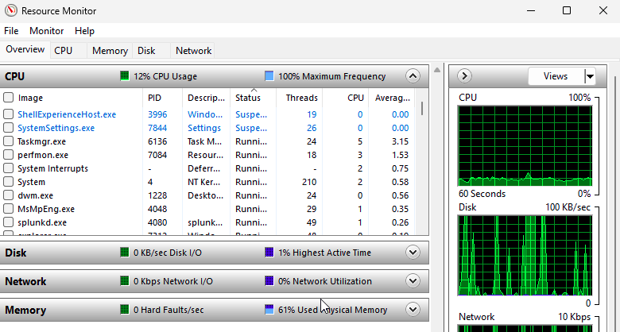

### CPU Tab
I inspected processes, threads, and CPU activity graphs for signs of high usage or stuck processes.

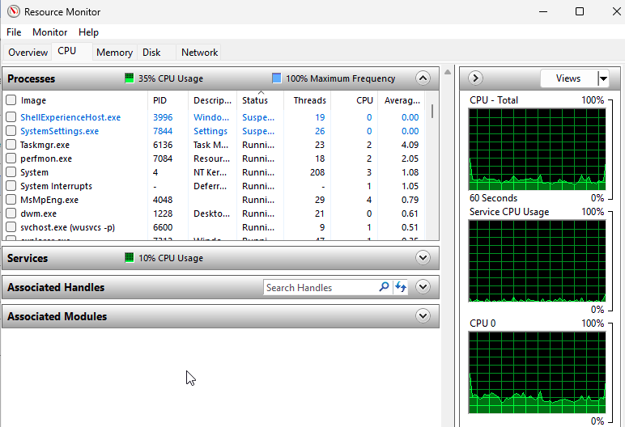

### Memory Tab
I checked memory usage, hard faults/sec, and overall RAM consumption.

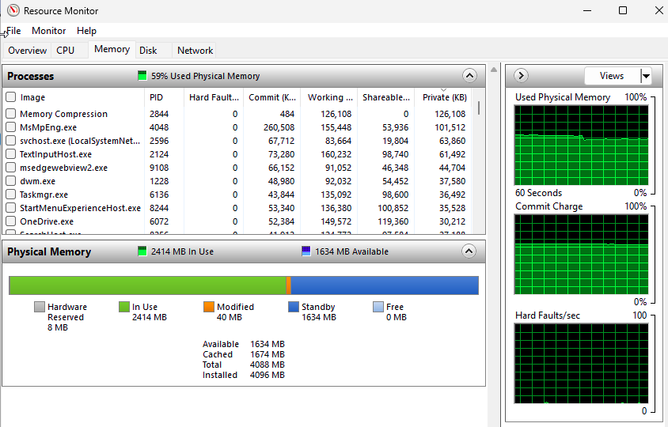

### Disk Tab
I reviewed active disk read/write operations and monitored disk I/O usage.

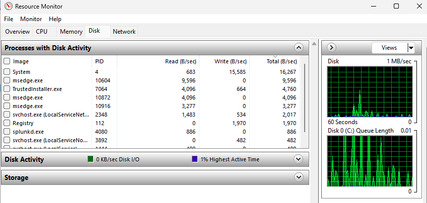

---

# Step 3 – Event Viewer Diagnostics

### Event Viewer Home
I opened Event Viewer to assess logs for critical, error, and warning events.

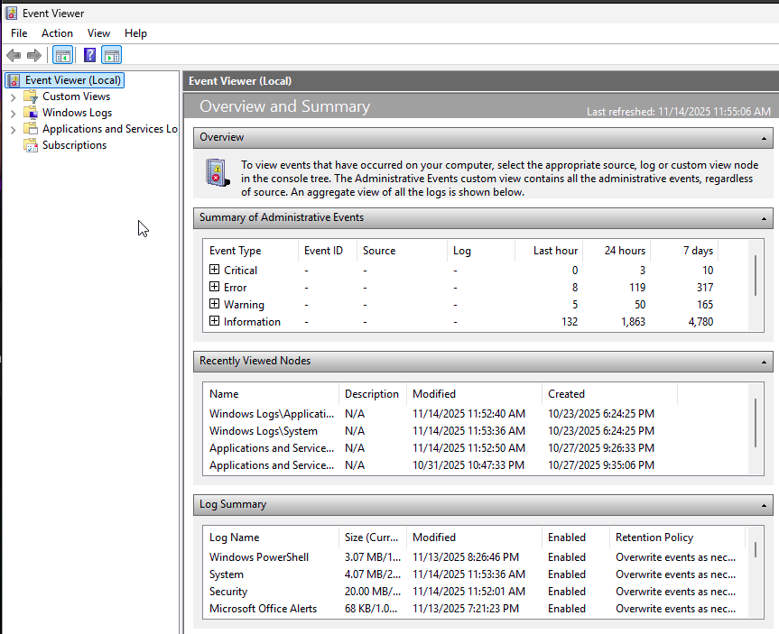

### System Log
I reviewed the System log for service failures, driver issues, disk problems, and performance warnings.

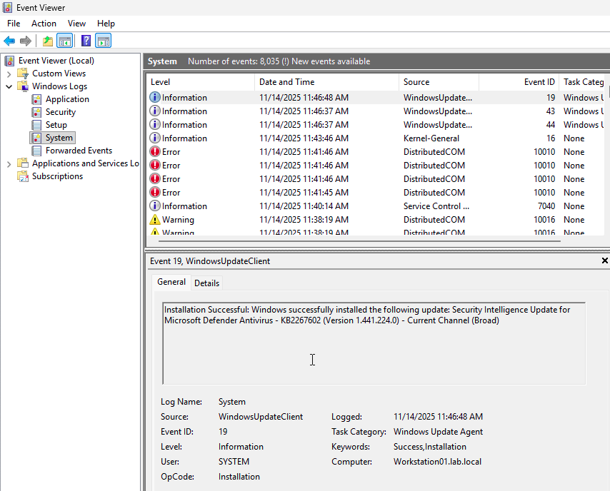

### Application Log
I inspected the Application log for application crashes, configuration errors, and warnings.

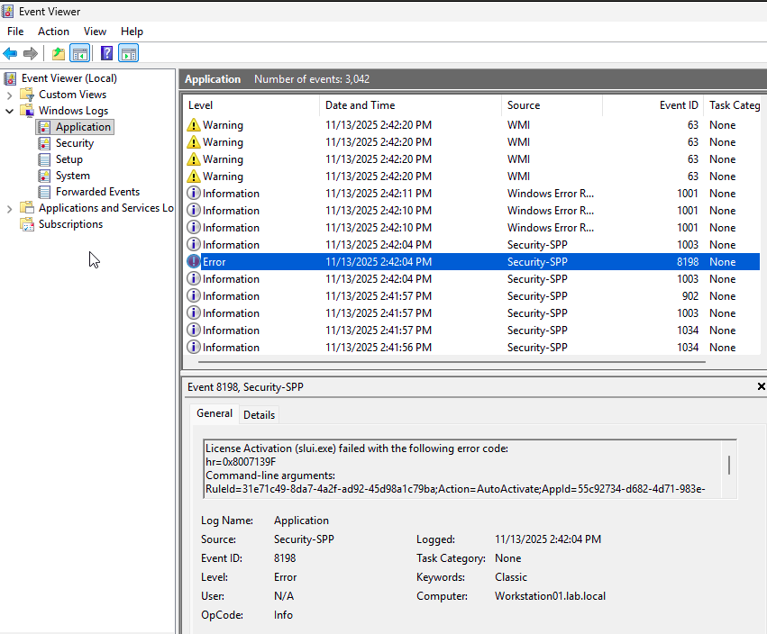

### Diagnostics-Performance (Boot/Shutdown Issues)
I navigated to Microsoft → Windows → Diagnostics-Performance → Operational to identify slow boot/shutdown events and performance degradation.

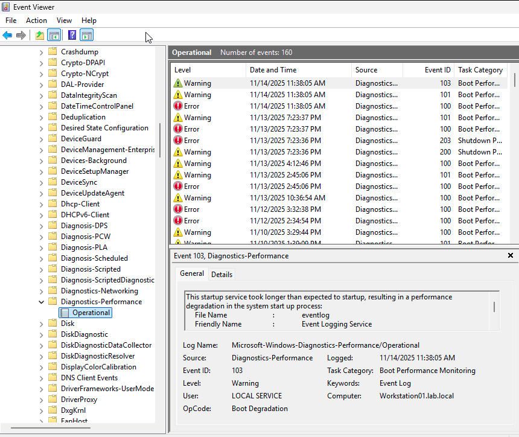

---

# Step 4 – System Health & Integrity Checks

### SFC (System File Checker)
I ran `sfc /scannow` to check and repair corrupted system files.

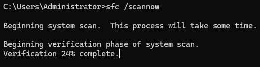

### DISM Health Restore
I used DISM to restore the Windows image and ensure system stability.

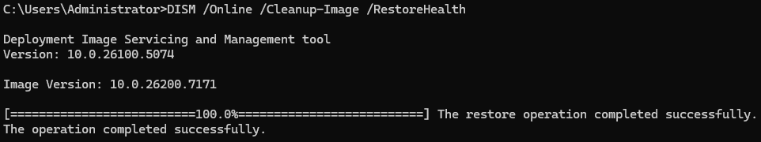

### CHKDSK (Disk Scan)
I ran a non-destructive CHKDSK scan to validate file system integrity.

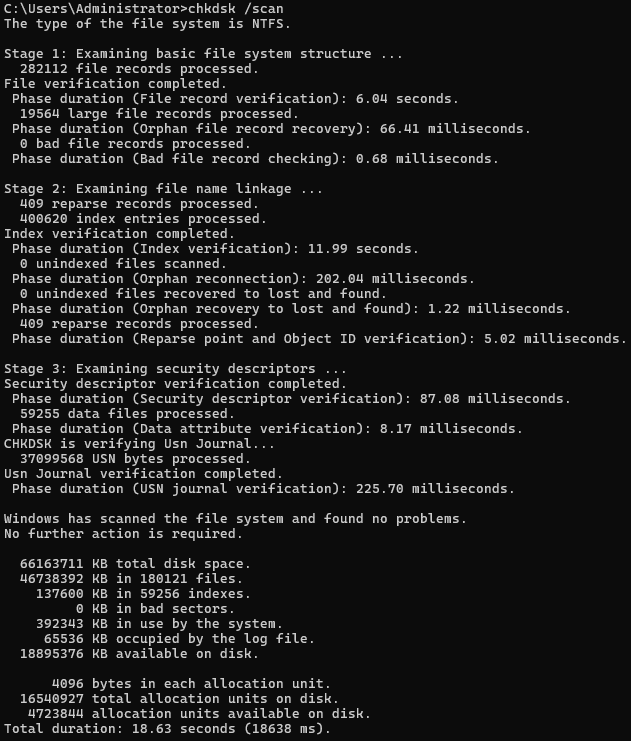

### Disk SMART Health (PowerShell)
Since WMIC is deprecated, I ran a PowerShell command to check the physical disk's health status.

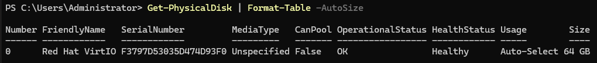

---

# Step 5 – Apply Fixes
I applied a simple performance optimization by disabling unnecessary startup applications.

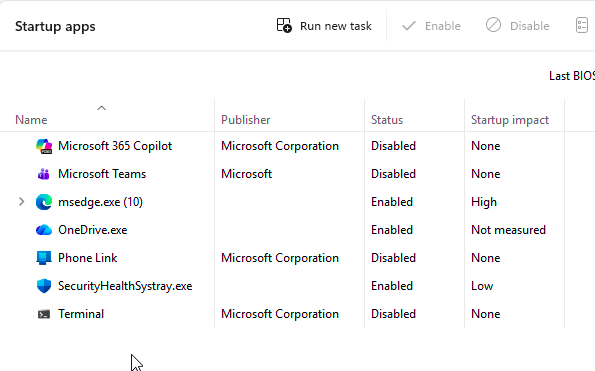

---

# Step 6 – Final Verification
I reopened Task Manager to confirm system stability after diagnostics and fixes. Resource levels appeared normal and consistent.

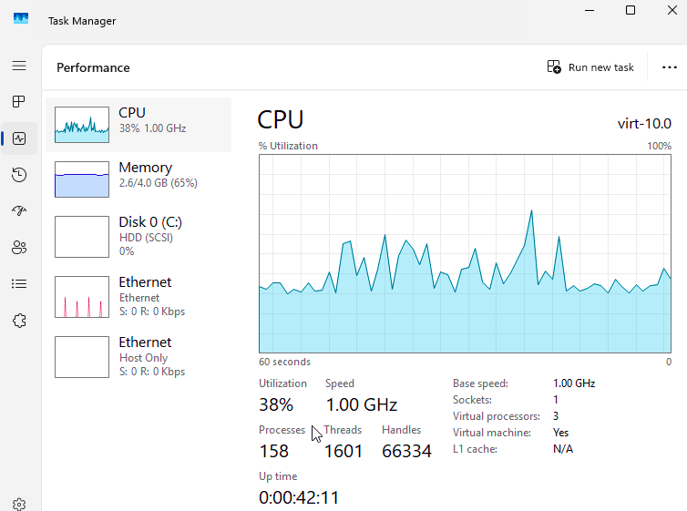

---

## Summary
By the end of this lab, I completed a full performance diagnostic workflow, including resource monitoring, event log analysis, system integrity repairs, disk health checks, and optimization actions. The system was confirmed to be stable and functioning normally after all steps were completed.

This lab demonstrates core skills required for Help Desk and IT Support roles, including performance troubleshooting, log analysis, and system maintenance.
