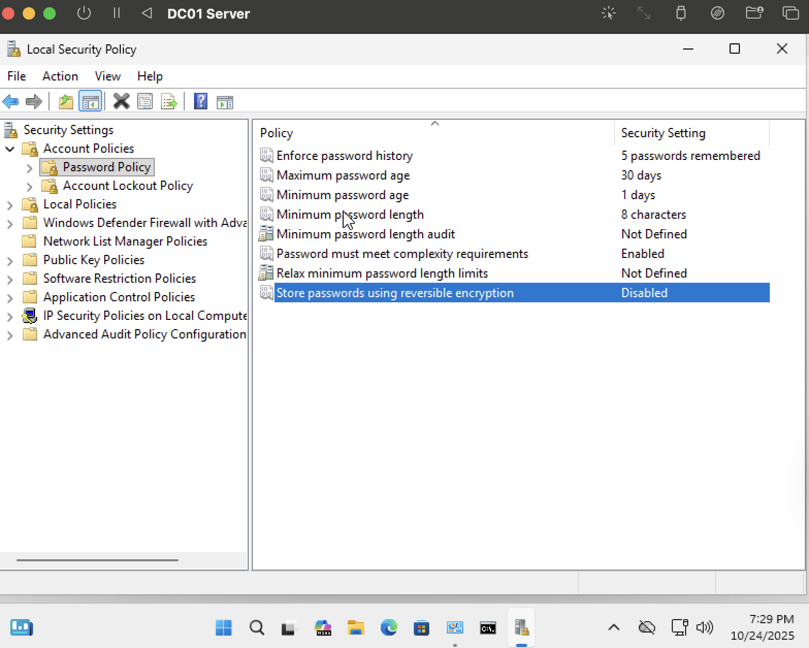
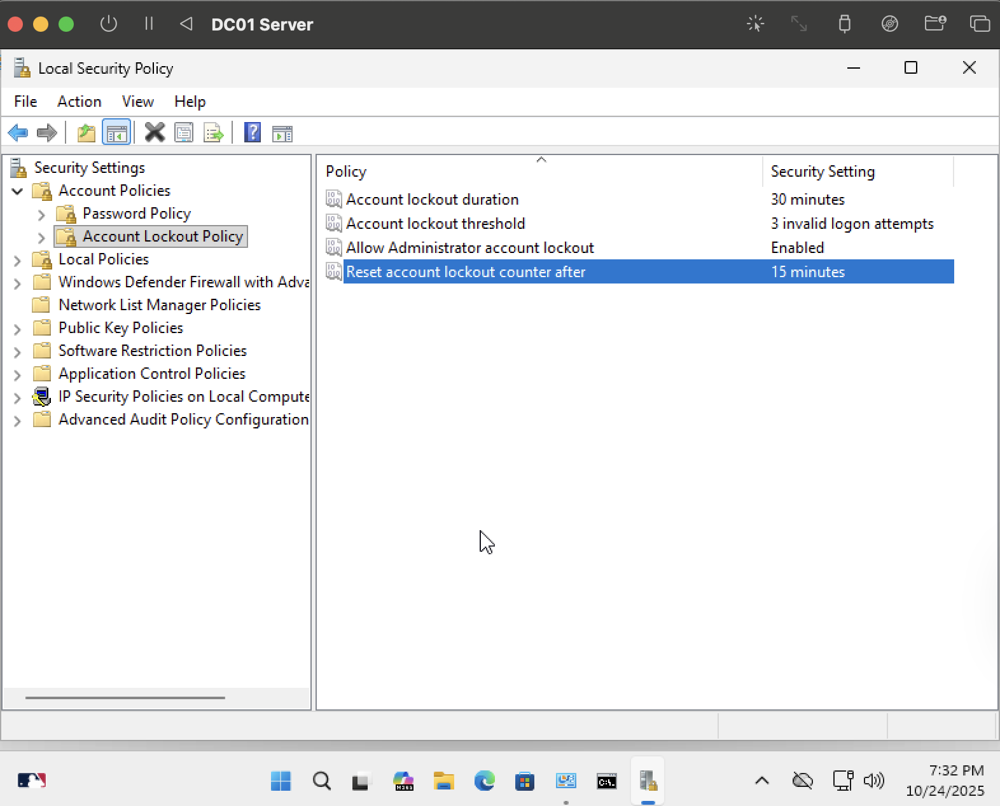
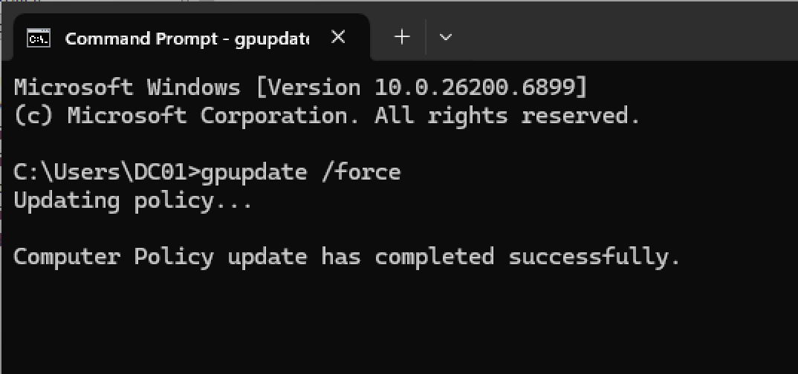
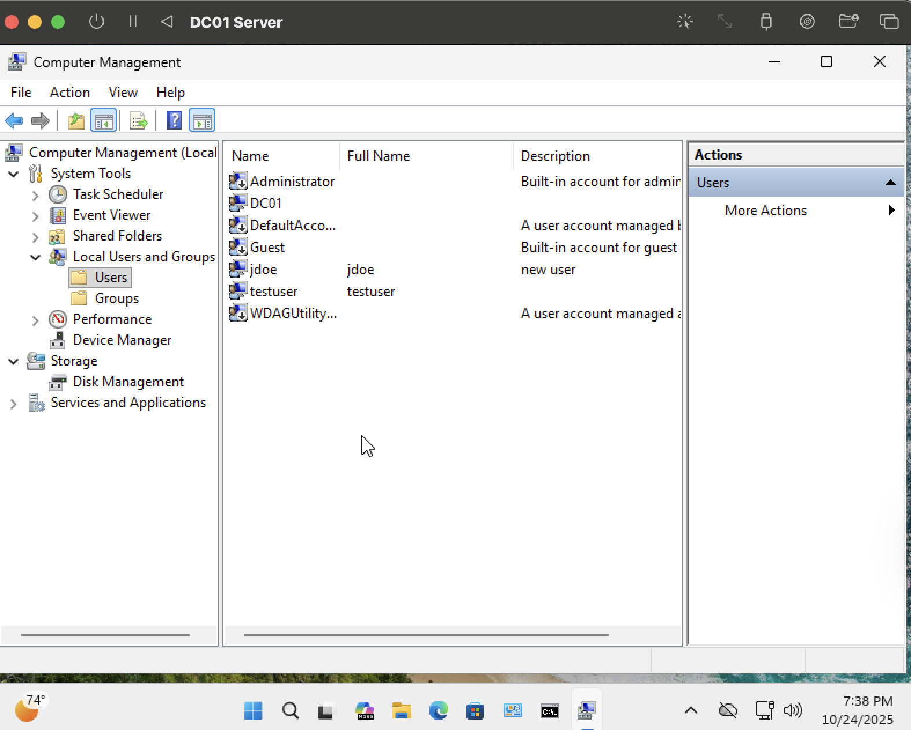
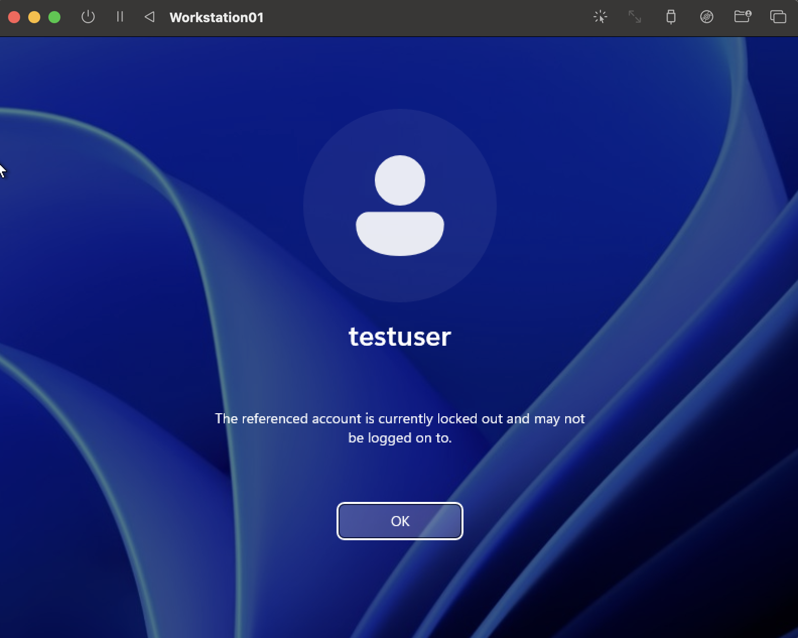
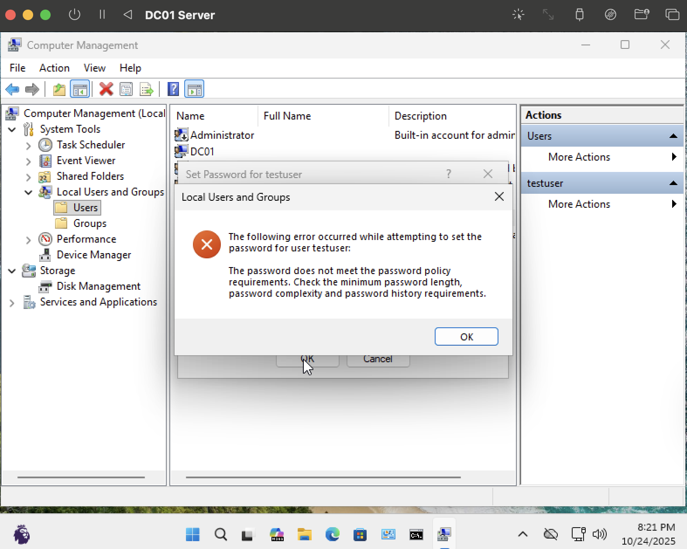
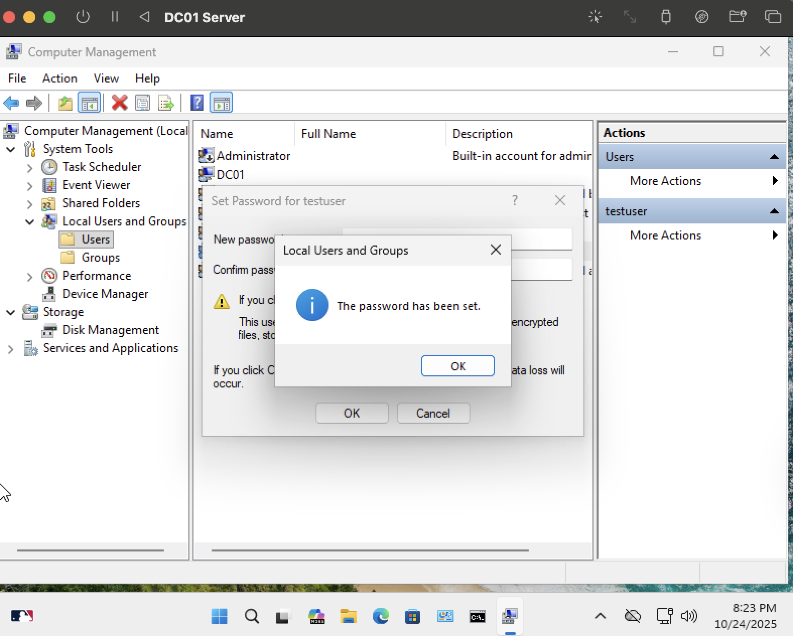

# 🧪 Lab 2 – Password Policy & Account Management

## 🎯 Objective
Implement and verify Windows password and account lockout policies to strengthen authentication security.

---

## 🧰 Environment
- **Server:** DC01 (Windows Server)
- **Client:** Workstation01 (Windows 10/11)
- **User:** Chris (Administrator)
- **Test Account:** testuser

---

## ⚙️ Configuration Steps

### 1. Configure Password Policy
1. On the **Server VM**, open:
secpol.msc

css

2. Navigate to:
Security Settings → Account Policies → Password Policy

yaml

3. Configure the following values:

| Policy | Setting |
|--------|----------|
| Enforce password history | 5 passwords remembered |
| Maximum password age | 30 days |
| Minimum password age | 1 day |
| Minimum password length | 8 characters |
| Password must meet complexity requirements | Enabled |
| Store passwords using reversible encryption | Disabled |

---

### 2. Configure Account Lockout Policy
1. Navigate to:
Security Settings → Account Policies → Account Lockout Policy

yaml

2. Configure these settings:

| Policy | Setting |
|--------|----------|
| Account lockout duration | 30 minutes |
| Account lockout threshold | 3 invalid logon attempts |
| Reset account lockout counter after | 15 minutes |
| Allow Administrator account lockout | Enabled |

---

### 3. Apply Group Policy
Run the following command to apply changes immediately:
gpupdate /force

yaml

---

### 4. Create Test User
1. Open:
Computer Management → Local Users and Groups → Users

sql
Copy code
2. Create a new user:
Username: testuser
Password: Test1234

yaml

---

## 🔍 Testing & Verification

### 1. Account Lockout Test
1. On the **Client VM**, attempt to log in as `testuser` using an incorrect password three times.
2. Observe the lockout message.

---

### 2. Password Complexity Test
1. Right-click `testuser` → **Set Password...**
2. Try to set a weak password such as `password`.  
- Windows rejects it, showing a complexity error.  

3. Try again with a strong password, for example `Test1234!`.  
- Windows accepts it successfully.  

---

## ✅ Results
- Password complexity, expiration, and history enforcement confirmed  
- Account lockout triggered after 3 failed attempts  
- Password complexity enforcement verified through failure and success tests  

---

yaml

---

## 🏁 Summary
This lab demonstrates how to enforce strong password policies and lockout thresholds in a Windows Server environment. The results confirm that repeated failed logins trigger account lockout, and weak passwords are rejected according to the configured complexity rules.
✅ You can copy this final version into your Lab2-PasswordPolicy/README.md and push it to GitHub.
Would you like me to give you the short commit message to pa
