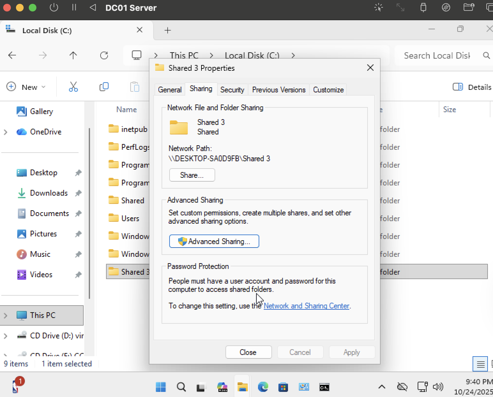
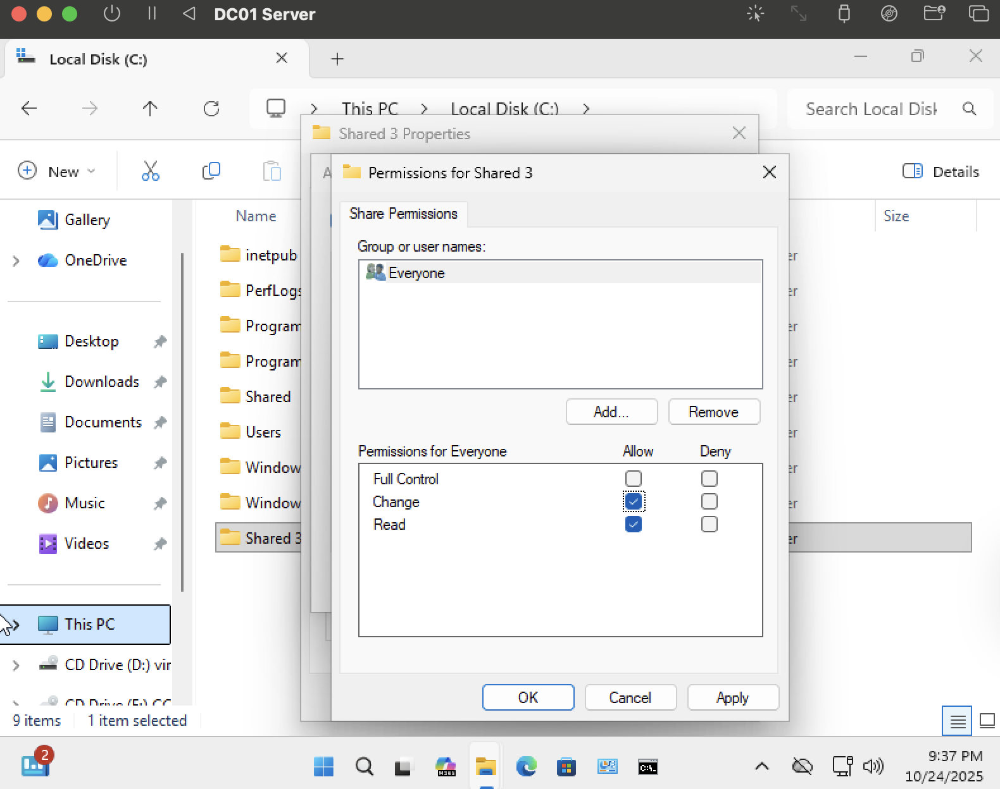
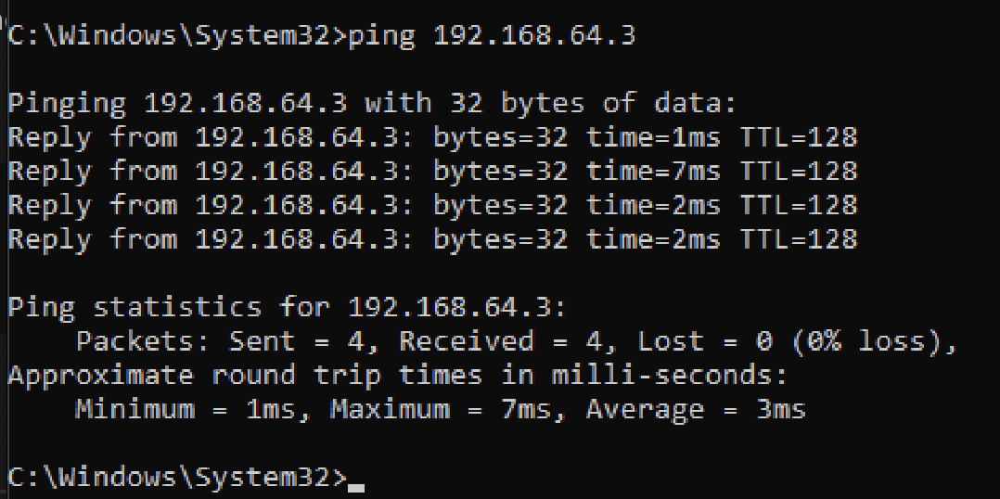
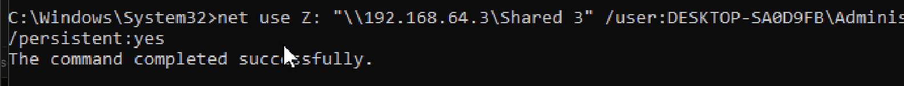
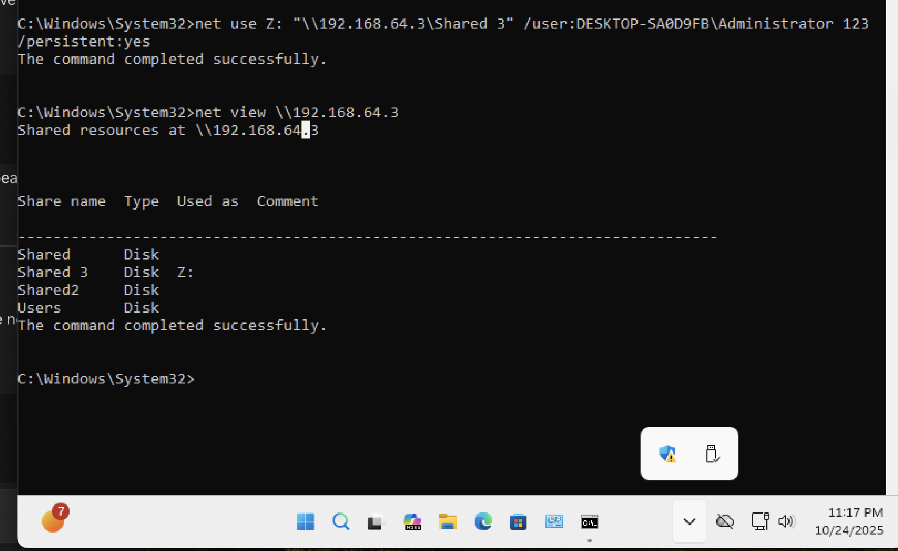
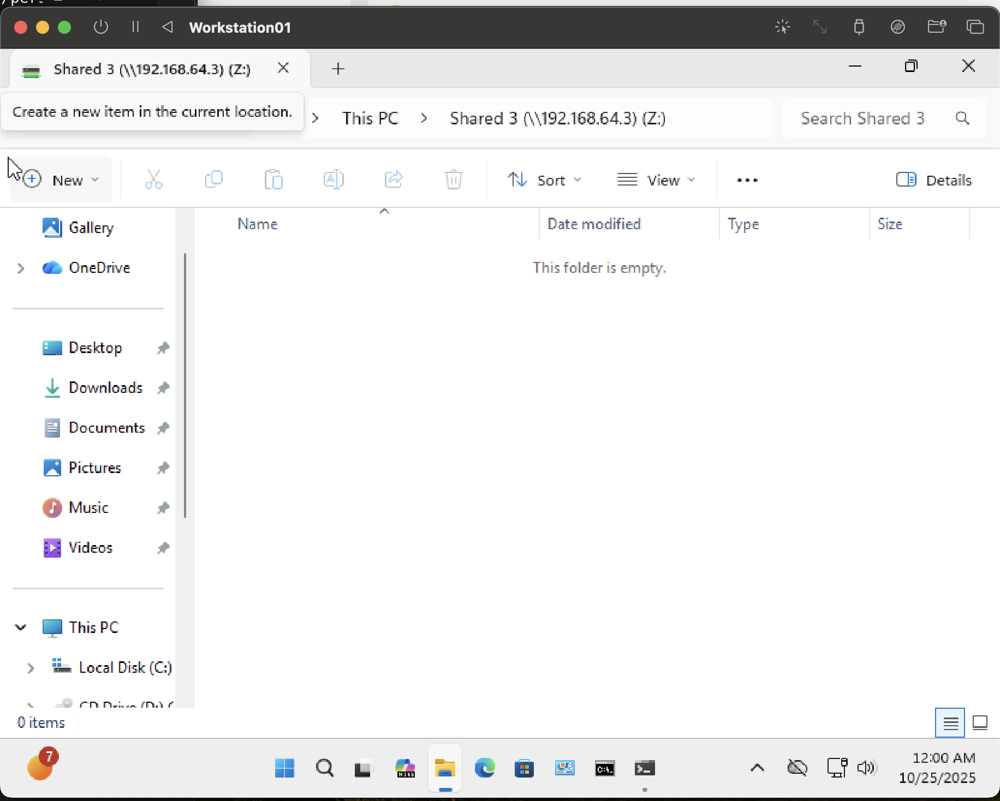

# Network Drive Mapping Lab – Windows Environment

## Overview
This project demonstrates how to configure and verify Windows network drive mapping between a **domain server (DC01)** and a **client workstation (Workstation01)**.  
The process includes sharing a folder, setting permissions, verifying connectivity, and mapping the shared folder to a network drive using the `net use` command.

---

## Skills Demonstrated
- Windows Server administration
- File and printer sharing configuration
- Network troubleshooting (ping, `net view`)
- SMB and permission management
- Command-line drive mapping (`net use`)
- Documentation and verification of network shares

---

## Environment
| Role | Hostname | OS | Purpose |
|------|-----------|----|----------|
| Server | DESKTOP-SA0D9FB | Windows Server | Hosts shared folder |
| Client | Workstation01 | Windows 10 | Connects to network share |

---

## Configuration and Verification Steps

### 1. Shared Folder Creation – Server
  
Created **C:\Shared 3** and enabled network sharing with path  
`\\DESKTOP-SA0D9FB\Shared 3`.

Configured share permissions to grant **Everyone** full control.  

---

### 2. Connectivity Verification – Client
Validated network reachability to the server via ICMP:
ping 192.168.64.3

yaml

---

### 3. Network Drive Mapping – Client
Mapped the shared folder to **Z:** using:
net use Z: "\192.168.64.3\Shared 3" /user:DESKTOP-SA0D9FB\Administrator 123 /persistent:yes

Mapping completed successfully.  

Verified available shares with:
net view \192.168.64.3

yaml

--- 

### 4. Drive Access and Confirmation
Listed mapped drive contents:
Z:
dir

yaml

Confirmed visibility of the mapped drive in File Explorer:  

---

## Outcome
- The client successfully mapped and accessed the **Shared 3** folder hosted on the server.  
- Drive **Z:** reconnects automatically at logon due to `/persistent:yes`.  
- Permissions and network connectivity were confirmed through both GUI and CLI verification.

---

## Key Takeaways
- Demonstrated practical understanding of **SMB file sharing** and **Windows network configuration**.  
- Reinforced troubleshooting skills using `ping`, `net share`, `net view`, and `net use`.  
- Produced full documentation suitable for a cybersecurity or system administration portfolio.

---

**Author:** Luis Chris Mejia  
*Date Completed: October 2025*  
**Repository:** [Help-Desk Portfolio](https://github.com/ChrisCyberTech/help-desk-portfolio)