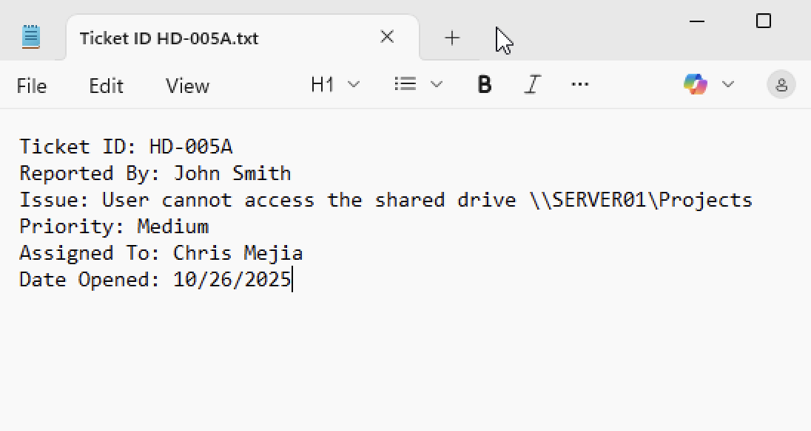
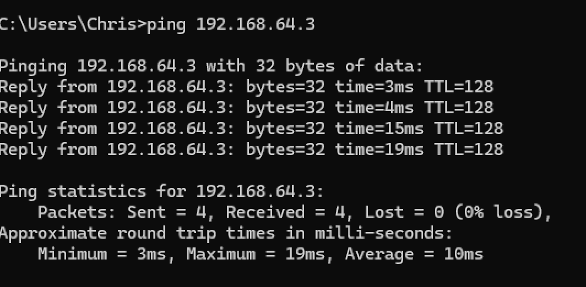
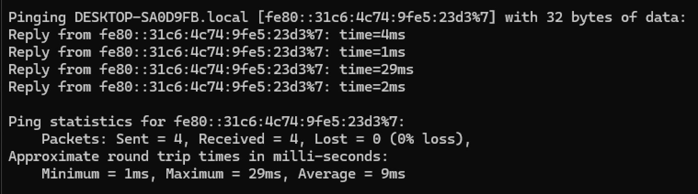
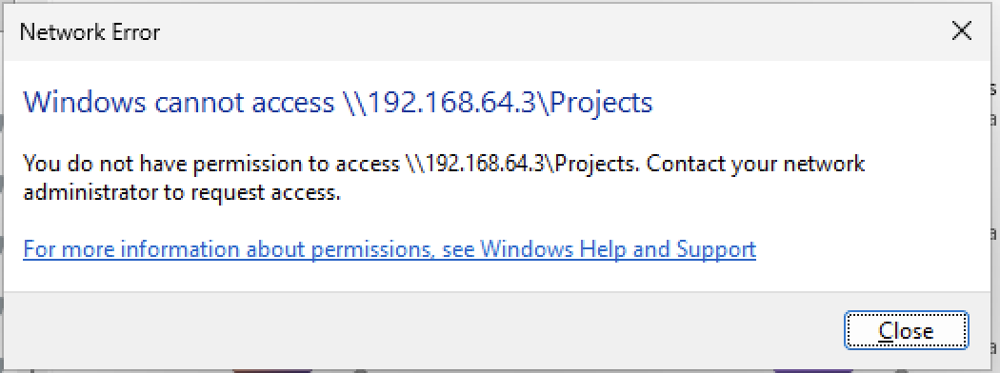
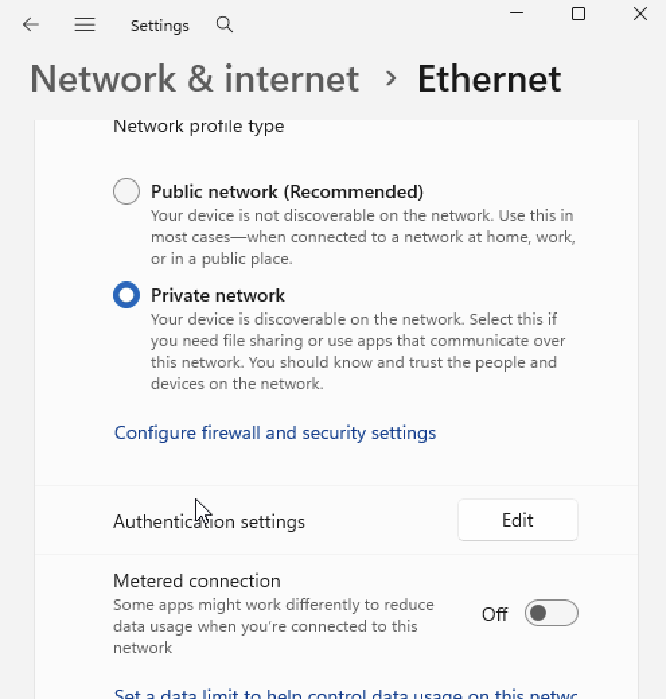
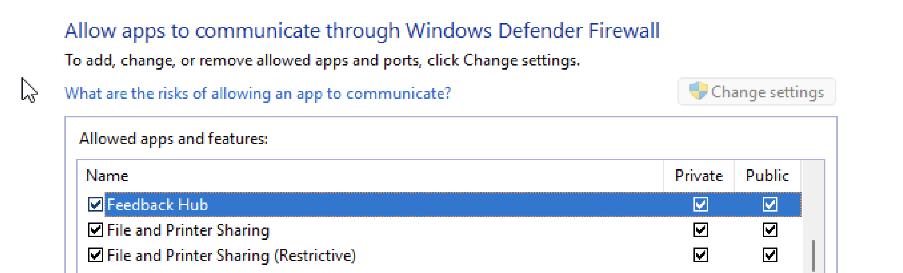
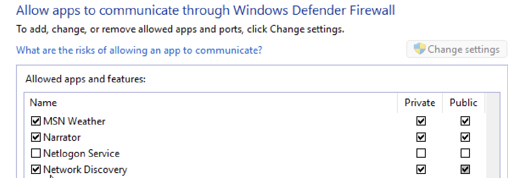
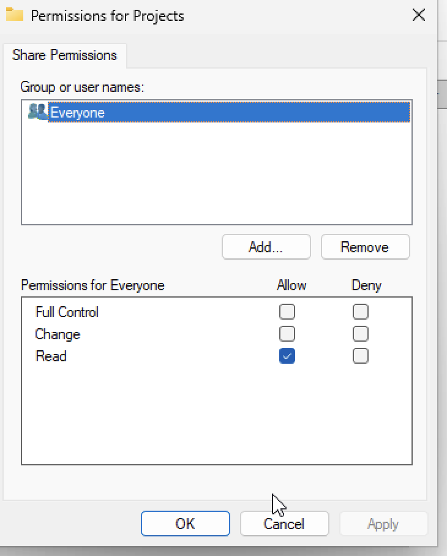
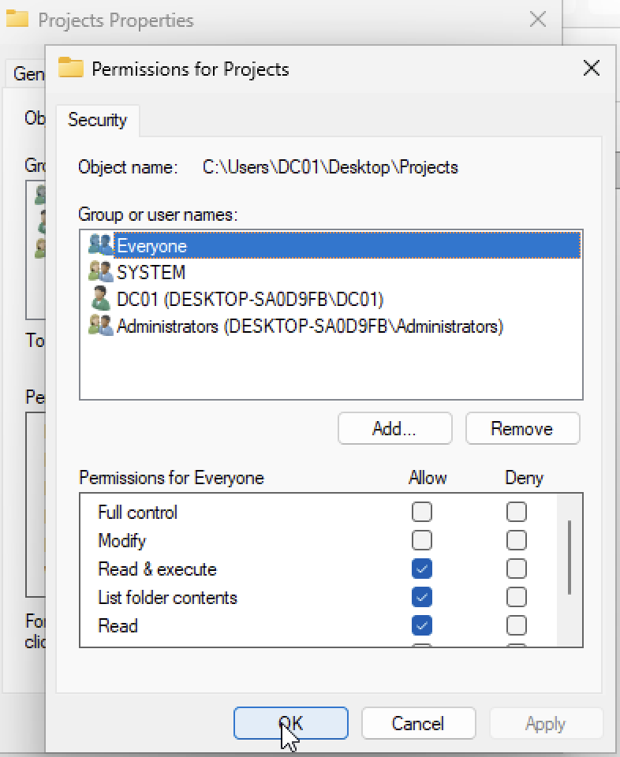
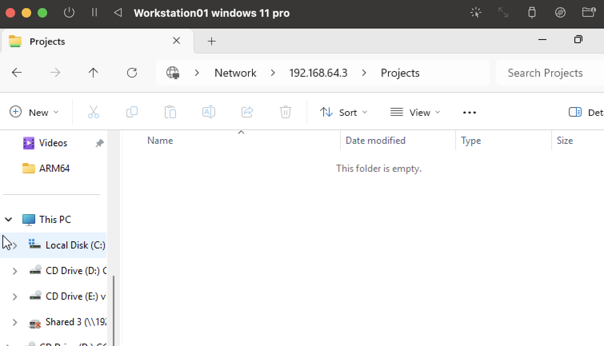

# 🧰 Lab 5A – Network Connectivity Troubleshooting
**Category:** Help Desk ⚙️  
**Scenario:** User cannot access shared folder on the network.  
**Environment:**  
- Client VM: Windows 11 Pro (192.168.64.2)  
- Server VM: Windows 11 Pro (192.168.64.3)  
- Network: Private 192.168.64.0/24  

---

## 🎯 Objective
Simulate a real Tier 1/Tier 2 help-desk troubleshooting process for a user reporting:  
> “Cannot access \\192.168.64.3\Projects shared folder.”

---

## 🧭 Phase 1 – Initial Triage
| Step | Action | Screenshot |
|------|---------|-------------|
| 1 | Ticket intake – issue logged in Notepad |  |
| 2 | Verified client IP configuration (`ipconfig /all`) |  |
| 3 | Verified server IP configuration (`ipconfig /all`) |  |
| 4 | Pinged server by IP (192.168.64.3) |  |
| 5 | Verified hostname resolution (`ping SERVERNAME`) |  |
| 6 | Attempted network access; error reproduced |  |
| 7 | Confirmed Private network profile enabled |  |

---

## 🧩 Phase 2 – Diagnosis and Fix
| Step | Action | Screenshot |
|------|---------|-------------|
| 1 | Verified Windows Firewall allows Network Discovery and File & Printer Sharing |     |
| 2 | Confirmed required discovery and SMB services are running (Function Discovery Provider Host, Function Discovery Resource Publication, Server, Workstation) |        |
| 3 | Retested connection; “Access Denied” confirmed – permissions issue isolated |  |

---

## 🔧 Phase 3 – Resolution & Verification
| Step | Action | Screenshot |
|------|---------|-------------|
| 1 | Updated share-level permissions → Everyone (Read) |  |
| 2 | Verified NTFS (Security) permissions → Everyone (Read & Execute) |  |
| 3 | Retested from client → successful folder access |  |

---

## 🧾 Resolution Summary
**Root Cause:** Missing share-level permission for user group.  
**Resolution:** Granted “Everyone → Read” access at both share and NTFS levels.  
**Result:** Client successfully accessed `\\192.168.64.3\Projects`.  
**Status:** ✅ Resolved (10/26/2025)

---

## 📁 Ticket Log
Ticket ID: HD-005A
Reported By: John Smith
Issue: User cannot access \192.168.64.3\Projects
Assigned To: Chris Mejia
Date Opened: 10/26/2025

Resolution:
Verified connectivity and firewall settings.
Identified permissions misconfiguration on shared folder.
Granted “Everyone → Read” access at share and NTFS levels.
Confirmed successful SMB access from client.

Status: Resolved Date Closed: 10/26/2025

---

✅ **Outcome:** Demonstrated full Tier 1/2 troubleshooting workflow — diagnosing and resolving network connectivity and permission issues in a Windows environment.
