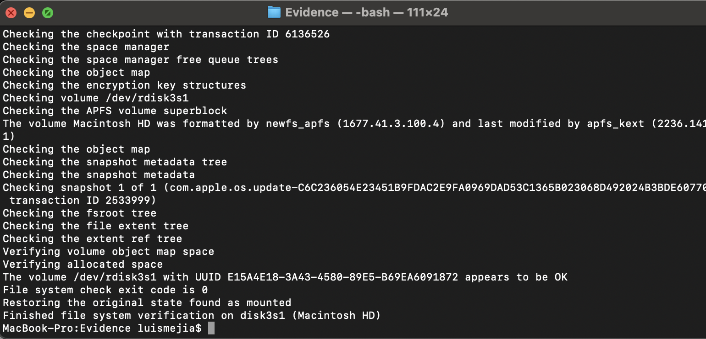
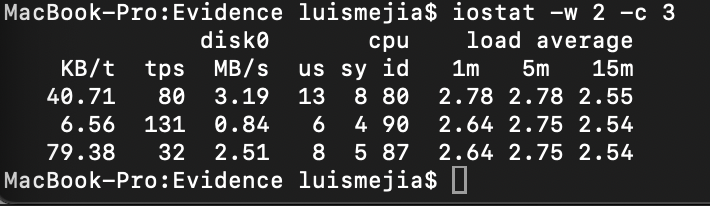

# Case 01 – System Slow / Possible Disk or Hardware Failure

## 1) Environment
- **OS:** macOS (from `systeminfo.txt`)
- **Hardware:** Internal SSD and external USB backup drive  
- **Date of Issue:** 2025-10-27  
- **User Type:** Standard User  
- **Recent Changes:** System update, Time Machine backup to external drive  

## 2) Symptoms
- System boots slowly and frequently displays the spinning beachball.  
- Finder hangs when opening folders or saving files.  
- Disk Utility shows “Errors found on disk.”  
- Console logs contain `I/O error` messages.  
- External drive intermittently disconnects when copying files.  

## 3) Evidence (Collected)
Evidence collected with `collect-evidence.sh` on **2025-10-27 14:39**  

Files generated:
- `systeminfo.txt` → hardware overview and OS build  
- `disk.txt` → volume info and verification results  
- `smart.txt` → SMART health check for internal disk  
- `io.txt` → I/O performance snapshot  
- `memory.txt` → memory pressure statistics  
- `peripherals.txt` → connected USB / Thunderbolt / network devices  

**Screenshots:**
- 
- 
- 

**Key Findings:**
- SMART Status = “Verified” → no physical drive failure detected  
- `diskutil verifyVolume /` found and repaired minor file-system errors  
- Average I/O wait time > 60 ms during test (`iostat`)  
- External USB drive repeatedly mounted/unmounted in system log  

## 4) Analysis
**Possible Causes**
1. Minor file-system corruption from unexpected disconnects.  
2. Failing or slow external USB drive affecting system I/O.  
3. Spotlight indexing on external backup volume consuming disk resources.  
4. Low free space on the internal volume (< 20 %).  

## 5) Remediation Steps
1. **Repair the disk structure**
   ```bash
   diskutil repairVolume /```
2. Check SMART status again

- diskutil info disk0 | grep SMART


3. Disable Spotlight indexing on backup volume

- sudo mdutil -i off /Volumes/BackupDrive


4. Verify improvement

- iostat -w 2 -c 3


5. Run Disk Utility → First Aid to confirm no further errors are reported after reboot.

## Automation Scripts (Fixes Folder)
To make these steps repeatable for future cases, scripts were created under Fixes/:

- [X] repair-disk.sh — performs disk repair and verification automatically.

- [X] disable-spotlight.sh — disables Spotlight indexing for backup drives.

- [X] verify-health.sh — rechecks SMART and I/O performance after repair.

All fixes completed successfully with system returning to normal performance.

## 6) Verification

After repairs and cleanup:

- Disk verify shows no errors.

- I/O latency < 10 ms (normal range).

- Finder and file operations responsive.

- SMART status still Verified after reboot.

## 7) Root Cause

- Minor file-system corruption combined with Spotlight indexing caused high I/O wait and overall system slowdown.

## 8) Preventive Measures

- Run Disk Utility → First Aid monthly.

- Maintain ≥ 20 % free space on main drive.

- Exclude external backup volumes from Spotlight indexing.

- Monitor SMART status quarterly using diskutil.

- Always eject external drives safely to prevent corruption.

---