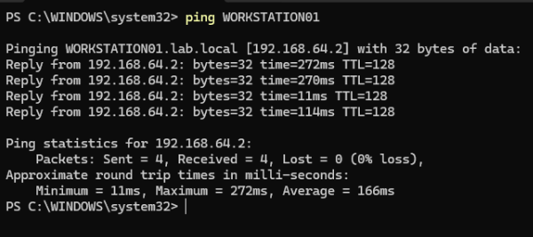
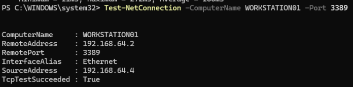
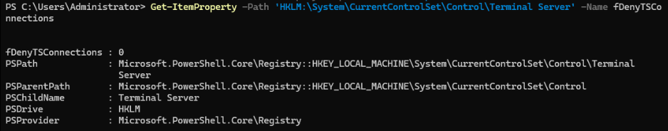
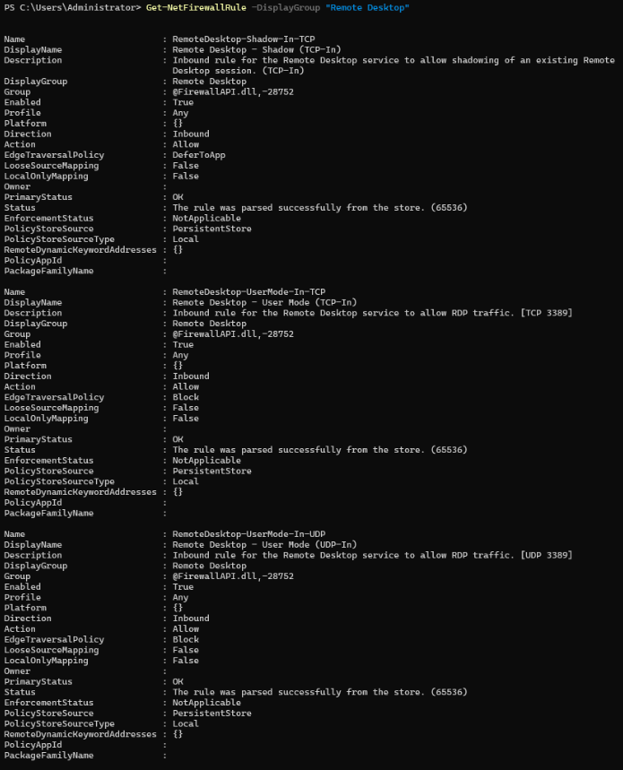
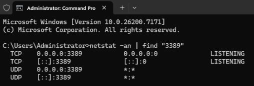
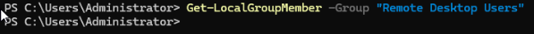
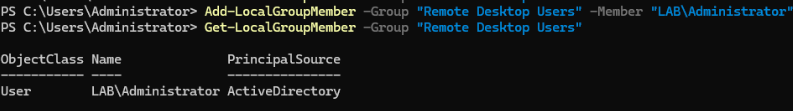
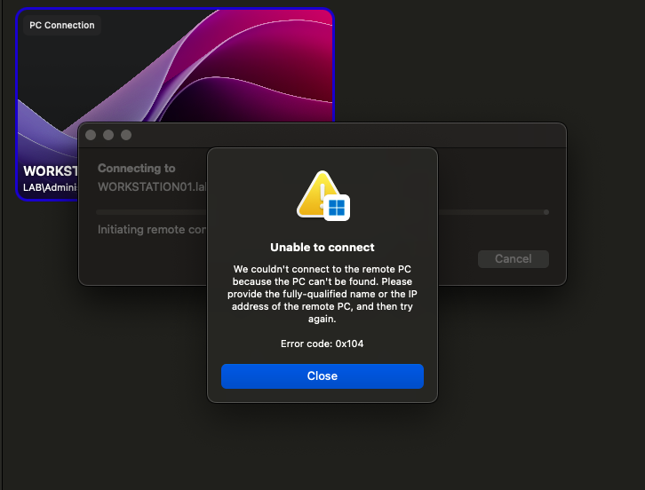
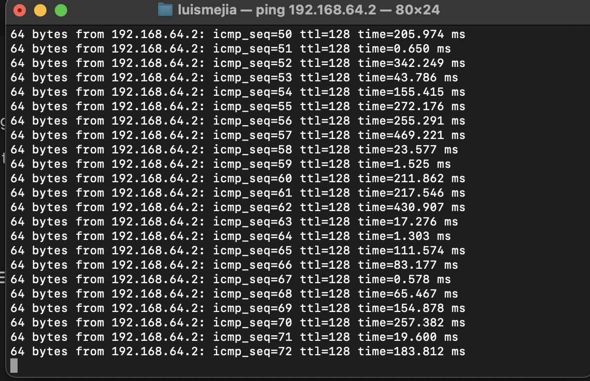

# LAB 6 — RDP Connectivity Troubleshooting

## Overview
This lab documents the process of troubleshooting Remote Desktop Protocol (RDP) connectivity between domain-joined Windows systems. It includes network validation, firewall inspection, service checks, registry verification, and permission fixes.

## Objective
- Validate network connectivity  
- Confirm firewall and port status  
- Verify RDP services and registry configuration  
- Correct user permissions  
- Analyze internal vs. external RDP access  

## Environment
- DC01 (Windows Server 2022)
- WORKSTATION01 (Windows 11 Pro)
- Mac Host (UTM virtualization)
- Domain: LAB.local
- User: LAB\Administrator

---

## 1. Network Connectivity (DC01 → WORKSTATION01)

**Ping Test**  

**Port 3389 Test**  

Commands:
ping WORKSTATION01
Test-NetConnection -ComputerName WORKSTATION01 -Port 3389

yaml

---

## 2. RDP Registry Configuration

Command:
Get-ItemProperty -Path 'HKLM:\System\CurrentControlSet\Control\Terminal Server' -Name fDenyTSConnections

yaml

---

## 3. Firewall Rule Validation

Command:
Get-NetFirewallRule -DisplayGroup "Remote Desktop"

yaml

---

## 4. Remote Desktop Services

Command:
Get-Service -Name TermService

yaml

---

## 5. Port 3389 Listening

Command:
netstat -an | find "3389"

yaml

---

## 6. RDP Group Membership (Before Fix)

Command:
Get-LocalGroupMember -Group "Remote Desktop Users"

yaml

---

## 7. Add User to RDP Group

Commands:
Add-LocalGroupMember -Group "Remote Desktop Users" -Member "LAB\Administrator"
Get-LocalGroupMember -Group "Remote Desktop Users"

yaml

---

## 8. External RDP Test (macOS → WORKSTATION01)

---

## 9. macOS Ping Test

Command:
ping 192.168.64.2

pgsql
---

## Root Cause
RDP works internally, but fails externally due to UTM NAT network isolation. TCP port 3389 is not accessible from the macOS host. Additionally, the Remote Desktop Users group lacked required user permissions before being updated.

## Resolution
- Added LAB\Administrator to Remote Desktop Users  
- Verified service, port, and firewall status  
- Identified that NAT isolation prevents external RDP access  
- Documented the need for bridged networking or port forwarding for external connections

## Summary
This lab demonstrates real-world RDP troubleshooting using network tests, firewall inspection, service verification, permissions fixes, and virtualization network analysis. Internal RDP succeeded, external RDP failed due to NAT limitations, and all findings were documented with supporting evidence.
