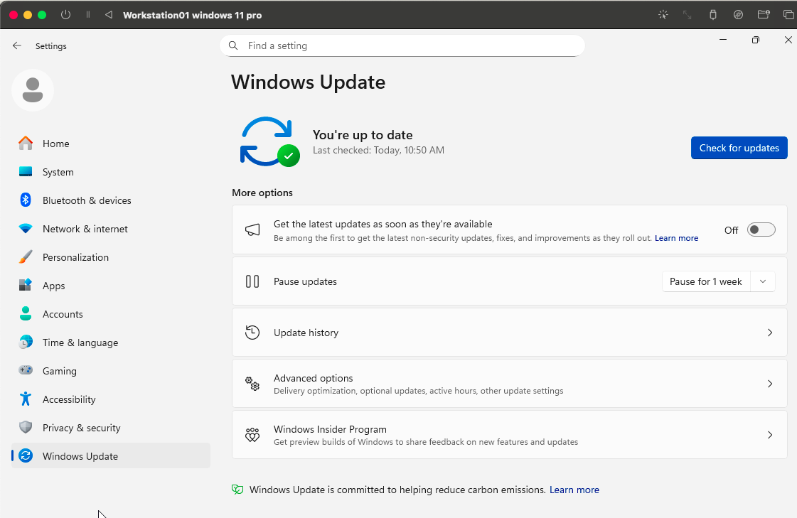
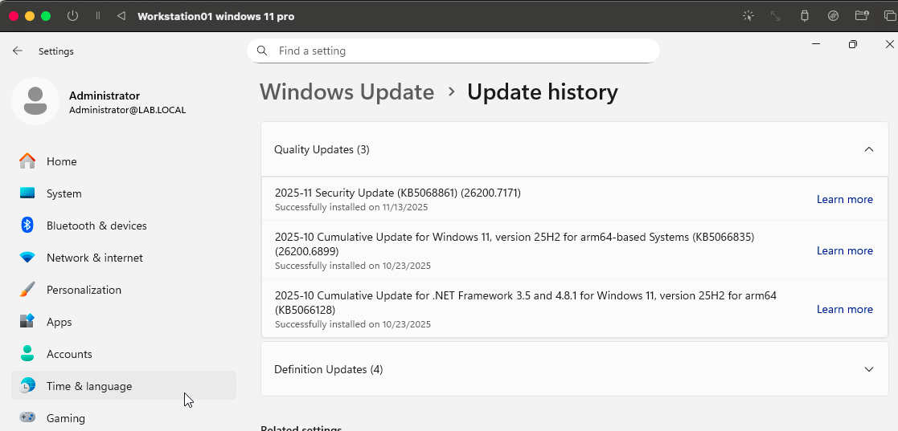
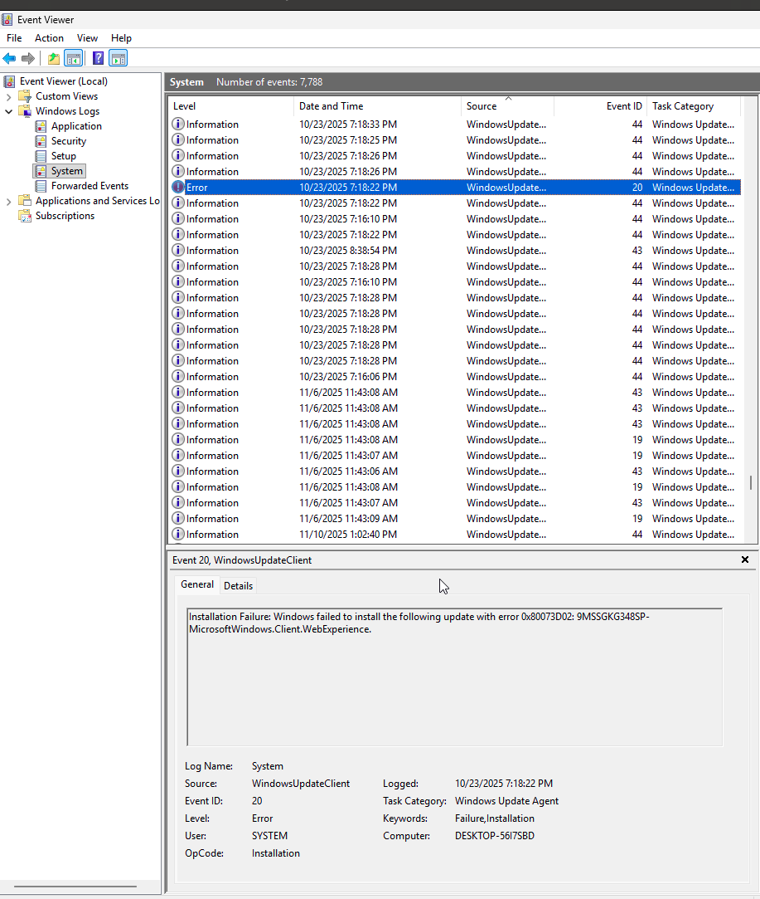
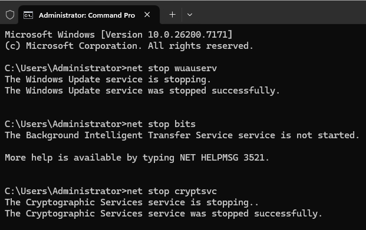
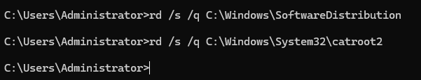
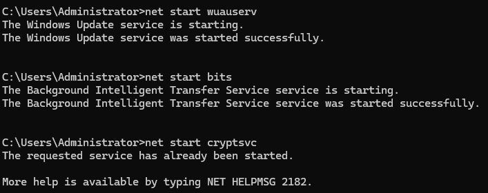
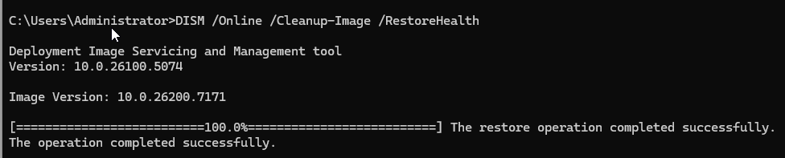
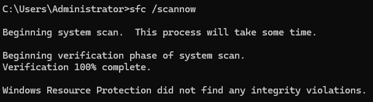
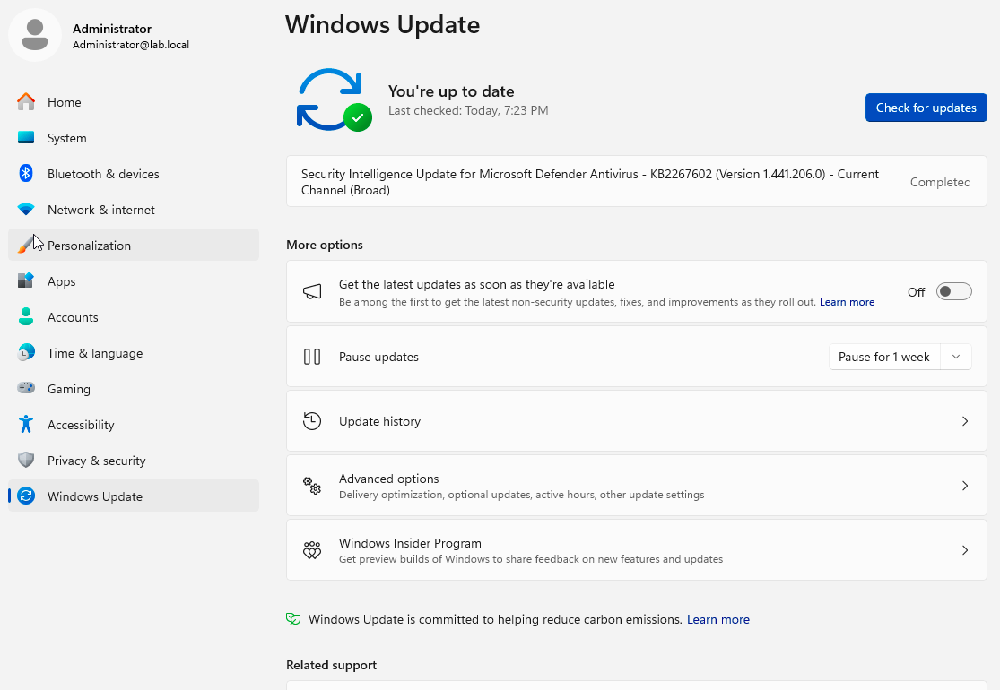

# Lab 8 – Windows Update & Patch Troubleshooting

**Objective:**  
Diagnose and repair Windows Update issues by resetting update services, clearing corrupted caches, running DISM and SFC, and verifying that updates install successfully.

---

## Ticket Scenario

**User:** Maria R.  
**Department:** Finance  

**Issue Reported:**  
“My computer has been trying to install updates for two days. It keeps saying ‘Pending install’ and I also saw error 0x80070002.”

**Symptoms:**  
- Updates stuck in “Pending install”  
- Update error codes in history  
- Device feels slow during update attempts  
- Multiple restarts did not fix the issue  

**Goal:**  
Repair Windows Update components and restore normal update functionality.

---

## Skills Learned

- Windows Update troubleshooting and workflow  
- Resetting Windows Update components  
- Clearing the SoftwareDistribution and Catroot2 directories  
- Using DISM to repair the Windows image  
- Using SFC to verify system integrity  
- Checking update logs in Event Viewer  
- Verifying successful post-repair update installation  

---

## Tools Used

- Windows Update settings  
- Event Viewer  
- Command Prompt (Admin)  
- DISM  
- SFC  
- Windows Update service manager  

---

## Screenshots

| Step | Description | Screenshot |
|------|-------------|------------|
| 1 | Windows Update main page |  |
| 2 | Update history view |  |
| 3 | Event Viewer update error |  |
| 4 | Stopping update services |  |
| 5 | Clearing SoftwareDistribution and Catroot2 |  |
| 6 | Restarting update services |  |
| 7 | DISM repair |  |
| 8 | SFC scan |  |
| 9 | Windows Update check after repair |  |
| 10 | Final successful update status |  |

---

## Work Log

### 1. Reviewed Windows Update Status  
Opened **Settings → Windows Update** and confirmed the system previously had updates installed but also had past failures.

### 2. Checked Update History  
Viewed **Update History** and confirmed previous updates installed successfully, but the ticket referenced earlier failures.

### 3. Investigated Event Viewer  
Opened **Event Viewer → Windows Logs → System** and filtered by errors.  
Located `WindowsUpdateClient` Event ID 20 with an installation failure message.

### 4. Stopped Windows Update Services  
Used an elevated Command Prompt to stop update-related services:

net stop wuauserv
net stop bits
net stop cryptsvc

shell

### 5. Cleared Corrupted Update Cache  
Deleted the SoftwareDistribution and Catroot2 directories:

rd /s /q C:\Windows\SoftwareDistribution
rd /s /q C:\Windows\System32\catroot2

### 6. Restarted Update Services  
Restarted the services to rebuild update components:

net start wuauserv
net start bits
net start cryptsvc

makefile

### 7. Ran DISM to Repair Windows Image  
Executed:

DISM /Online /Cleanup-Image /RestoreHealth

makefile

DISM completed successfully.

### 8. Ran System File Checker  
Executed:

sfc /scannow

SFC completed with no integrity violations.

### 9. Rebooted the System  
Restarted the workstation to apply changes and reload update components.

### 10. Verified Update Functionality  
Ran Windows Update again.  
Updates installed successfully and no new errors appeared.

---

## Summary

Resolved Windows Update malfunction by:

- Investigating update history and Event Viewer logs  
- Resetting the Windows Update services  
- Clearing corrupted update cache folders  
- Running DISM and SFC to repair system components  
- Verifying successful update installation after repair  

Windows Update is functioning normally and no further issues were detected.