# Lab 9 – VPN Troubleshooting

**Objective:**  
Diagnose and repair VPN connection issues involving credentials, DNS failures, blocked ports, and certificate trust problems.  
This lab simulates real Help Desk VPN troubleshooting steps using Windows networking tools, PowerShell, Event Viewer, and certificate management.

---

## Ticket Scenario

**User:** Michael T.  
**Department:** Accounting  

**Issue Reported:**  
“I can’t connect to the VPN. It keeps failing no matter what I try.”

**Symptoms:**  
- VPN immediately disconnects  
- DNS lookups failing  
- Event Viewer shows RasClient errors  
- Possible port or firewall blocking  
- Certificate trust errors when using IKEv2  

**Environment Notes:**  
The workstation is a domain-joined Windows 11 client.  
The VPN server is simulated using a fake IP and a self-signed certificate.

---

# Scenario 1 – Credential Failure

**Explanation:**  
The user attempts to connect but fails due to either incorrect credentials or unresolved hostnames. The first step is to verify the VPN profile and confirm whether the client is attempting to reach the correct destination.

**VPN profile created**  
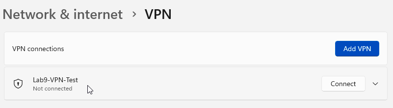

**VPN fails due to name resolution**  
The hostname cannot be resolved, preventing authentication from starting.  

**VPN fails even when using raw IP**  
This confirms the issue is not DNS-only and may involve authentication or network reachability.  
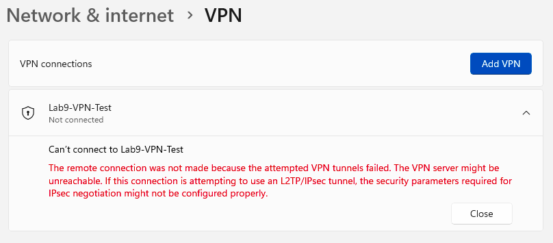

---

# Scenario 2 – DNS Failure

**Explanation:**  
DNS problems frequently break VPN connections. The user’s DNS was changed to a non-existent IP, causing hostname failures. Nslookup testing validates whether DNS is functional before retrying the VPN.

**Client DNS changed**  
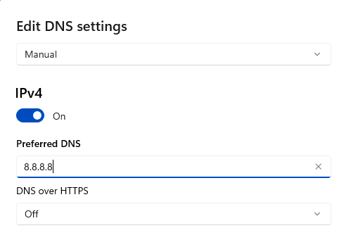

**nslookup failure**  
The VPN hostname cannot resolve due to incorrect DNS configuration.  
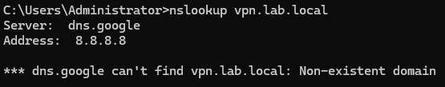

**VPN fails due to DNS issue**  
Authentication cannot start because the hostname never resolves.  
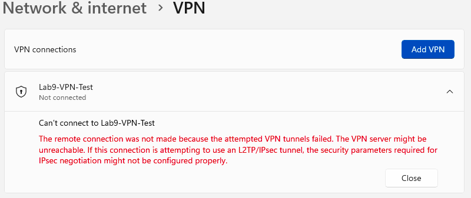

**DNS restored**  

**nslookup successful after fix**  
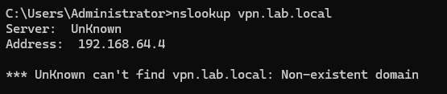

---

# Scenario 3 – Port Blocking (443, 500, 4500)

**Explanation:**  
VPNs rely on specific ports depending on the protocol. For IKEv2/IPSec, ports 443, 500, and 4500 are critical. These tests simulate network firewalls blocking required ports.

**Outbound port 443 blocked**  
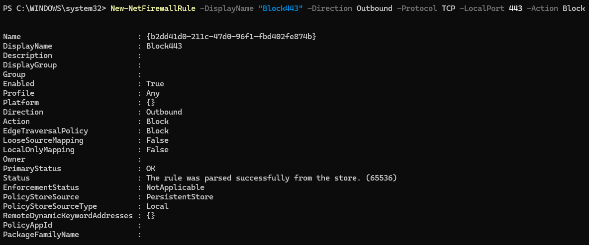

**Test-NetConnection shows 443 blocked**  
Confirms traffic cannot escape the workstation on that port.  
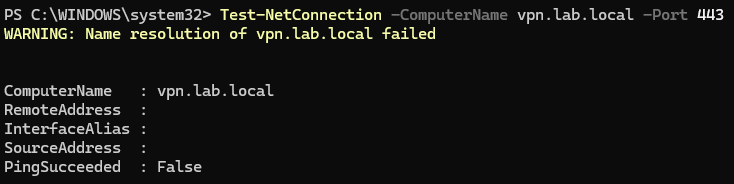

**VPN fails due to blocked 443**  

**Ports 500 and 4500 blocked**  
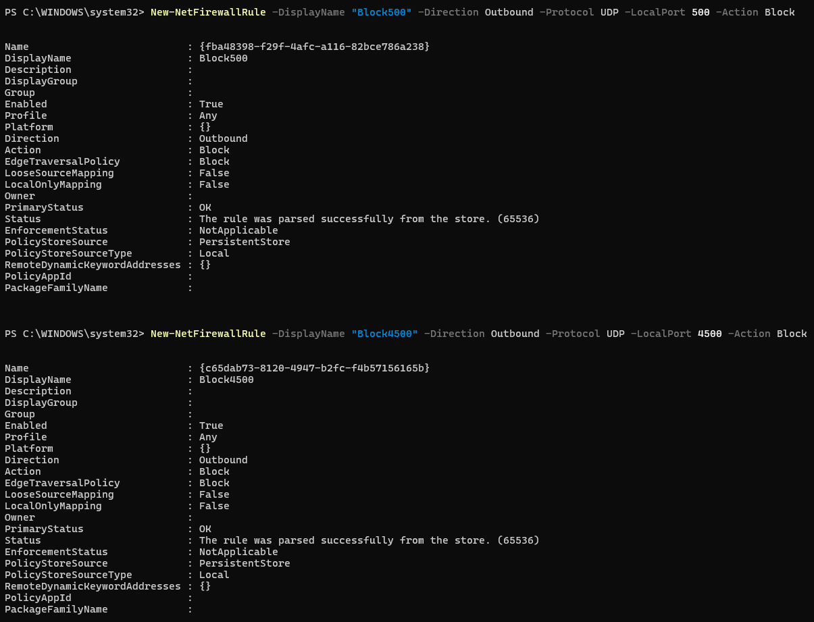

**VPN failure due to blocked IPsec ports**  
IKEv2 cannot negotiate key exchange.  
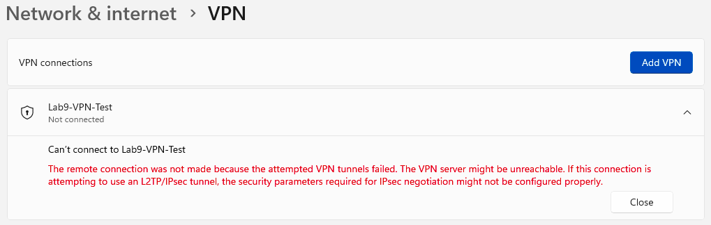

**Firewall rules removed**  
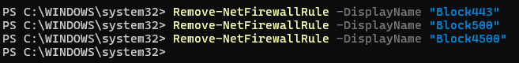

---

# Scenario 4 – Certificate Trust Failure (IKEv2)

**Explanation:**  
IKEv2 requires certificate trust. Without the correct certificate installed in the client Trusted Root store, authentication immediately fails. This scenario replicates that behavior.

**Self-signed VPN certificate created**  
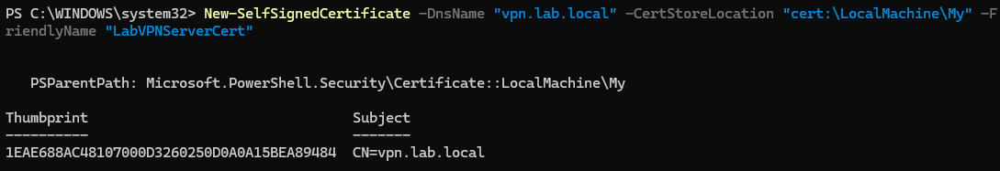

**Certificate exported**  

**Certificate transferred to client**  

**DC01 Desktop Share**  
Used for certificate distribution  
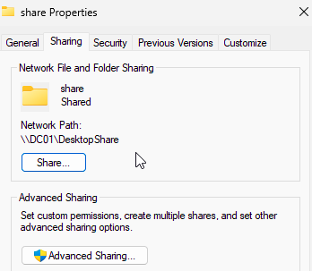

**Client accessing the share**  
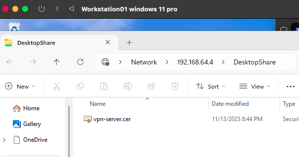

**Certificate installed into Trusted Root**  
Required for IKEv2 trust.  
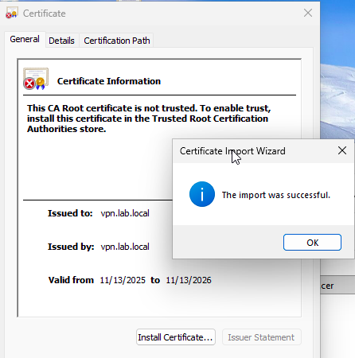

**Initial no-cert VPN error**  
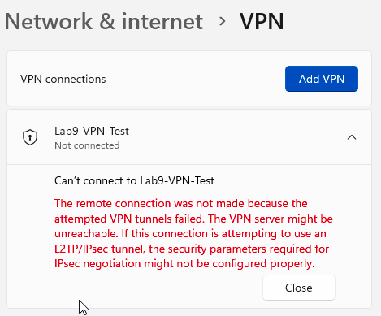

**IKEv2 settings applied**  
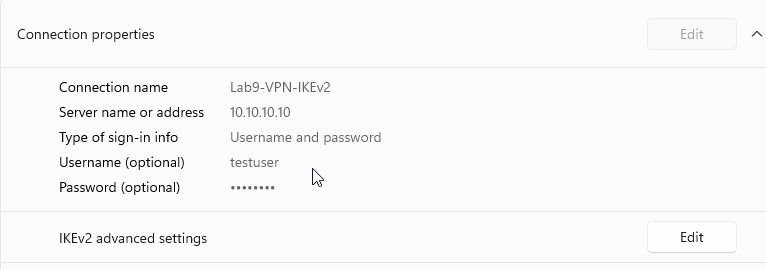

**Certificate error captured in Event Viewer (RasClient)**  
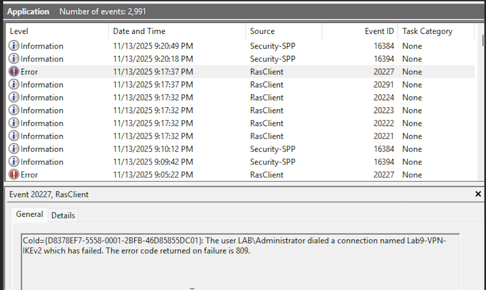

**Certificate trust restored successfully**  
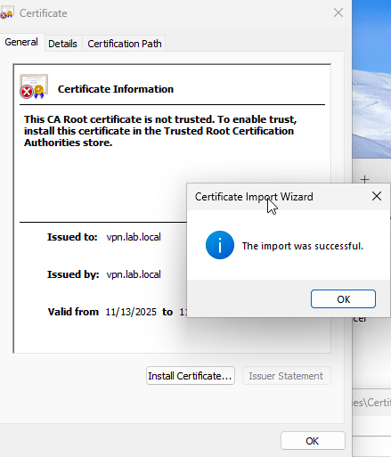

**VPN error after certificate fix (non-certificate)**  
Shows that the cert trust issue is resolved.  

---

# Summary

This lab demonstrated troubleshooting for four major VPN problem categories:

1. **Credential failures** – Incorrect usernames, passwords, or unreachable authentication servers  
2. **DNS failures** – Misconfigured resolvers, hostname lookup issues  
3. **Port blocks** – Network firewalls blocking required ports (443, 500, 4500)  
4. **Certificate trust issues** – Missing or untrusted certificates for IKEv2 authentication  

Tools and skills practiced:

- Windows VPN client configuration  
- DNS management and nslookup testing  
- PowerShell network testing (Test-NetConnection)  
- Windows Firewall rule manipulation  
- Certificate Manager (certlm.msc)  
- Event Viewer (RasClient logs)  
- Understanding IKEv2/IPsec dependencies  

This workflow reflects real Help Desk and SysAdmin troubleshooting in corporate VPN environments.
